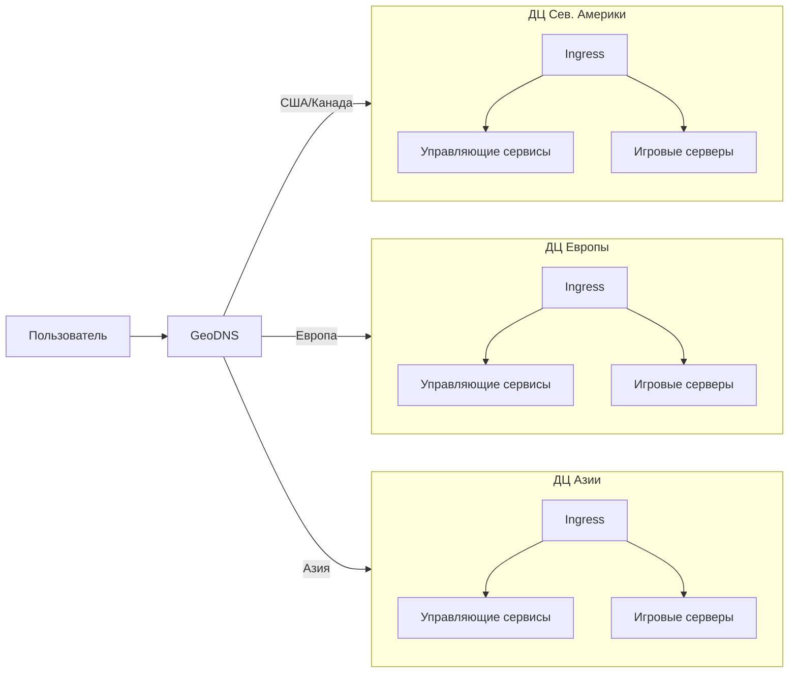
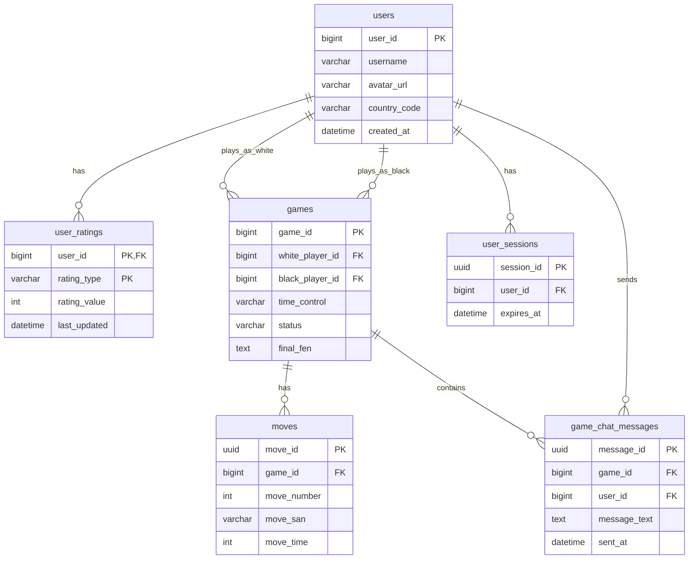

Курсовая работа по дисциплине "Проектирование высоконагруженных систем"

*Малютин Илья, осень 2025*

## Содержание
* [**1. Тема, аудитория, функционал**](#1-тема-аудитория-функционал)
* [**2. Расчёт нагрузки**](#2-расчёт-нагрузки)
* [**3. Глобальная балансировка нагрузки**](#3-глобальная-балансировка-нагрузки)
* [**4. Локальная балансировка нагрузки**](#4-локальная-балансировка-нагрузки)
* [**5. Логическая схема БД**](#5-логическая-схема-бд)
* [**6. Физическая схема БД**](#6-физическая-схема-бд)

## 1. Тема, аудитория, функционал

### Тема
Chess.com - онлайн-платформа для игры в шахматы

### Аудитория

#### Мировой рынок [[1](https://www.buzzsprout.com/2432582/episodes/17541516-how-chess-com-became-the-world-s-top-chess-app)]
* Пользователи:
  * ```45 млн MAU```
  * ```10 млн DAU```
  * ```20 млн игр в день```
  * ```Самый популярный формат игры - рапид 10+0 минут```


#### Распределение по странам [[2](https://www.chess.com/article/view/chess-countries)]
* *США - ```21.95%``` пользователей*
* *Индия - ```10.20%``` пользователей*
* *Великобритания - ```4.45%``` пользователей*
* *Филиппины - ```3.65%``` пользователей*
* *Бразилия - ```3.55%``` пользователей*
* *Россия - ```3.25%``` пользователей*
* *Остальные страны - ```52.95%``` пользователей*

### Функционал

Ключевой функционал - онлайн-игра в шахматы

Ключевые продуктовые решения:
* Обучение и аналитика игр
* Регистрация и авторизация
* Поиск и автоматический подбор соперника
* Онлайн-игра в шахматы
* Система рейтингов ELO
* История и анализ партий
* Текстовый чат во время игры

## 2. Расчёт нагрузки

* Допущения:
    * Размер аватарки 100 Кб (Chess.com загружает аватарки 200x200 jpeg)
    * Профиль пользователя: имя (3-20 символов), рейтинг, статистика - 2 Кб
    * Одна шахматная партия: 40 ходов, 1 Кб на хранение (т.к. - ход это простая символьная строка длиной не более 4х)
    * Средняя продолжительность игры: 10 минут (самый популярный контроль времени 10+0 минут)
    * Пиковая нагрузка в 3 раза больше средней в общем случае и в 4 раза больше для операций ходов
    * Сообщение в чате: 100 символов
    * 5 сообщений на игру

### Расчет среднего размера хранилища на одного пользователя
* Профиль пользователя

$$100 + 2 = 102 \space Кб$$

* История партий

$$\frac{20 \cdot 10^6}{10 \cdot 10^6} = 2 \space игры \space в  \space день \space на \space DAU$$

$$2 \cdot 30 = 60 \space игр \space в  \space месяц$$

$$60 \cdot 1 \space Кб = 60 \space Кб$$

* Сообщения в чате

$$60 \cdot 5 \cdot 100 \cdot 1 \space байт = 30 \space Кб$$

### Расчет среднего количества действий пользователя по типам в день [[5](https://www.chess.com/ru/article/view/shakhmaty-tak-populiarny-chto-servera-chess-com-ne-spravliaiutsia)]
* Авторизация: 1 раз в день
* Поиск соперника: 2 раза в день
* Сделать ход: 80 полуходов × 2 игры = 160 действий
* Отправка сообщений: 10 сообщений в день
* Просмотр истории: 2 раза в день
* Анализ партии: 1 раз в день

### Продуктовые метрики

| Метрика                                | Значение                  |
|----------------------------------------|---------------------------|
| Месячная аудитория (MAU)               | 45 млн пользователей      |
| Дневная аудитория (DAU)                | 10 млн пользователей      |
| Профиль пользователя                   | ~102 КБ                   |
| История партий                         | ~60 КБ/мес               |
| Сообщения чата                         | ~30 КБ/мес               |
| Авторизация                            | 1/день                   |
| Поиск соперника                        | 2/день                   |
| Ходы в играх                           | 160 полуходов /день                 |
| Отправка сообщений                     | 10/день                  |
| Просмотр истории                       | 2/день                   |
| Анализ партии                          | 1/день                   |

### Расчет размера хранилища данных

* Профили пользователей

$$\frac{102 \cdot 45 \cdot 10^6}{1024 \cdot 1024 \cdot 1024} = 4,27 \space Тб$$

* История партий (за месяц)

$$\frac{60 \cdot 45 \cdot 10^6}{1024 \cdot 1024 \cdot 1024} = 2,51 \space Тб/мес$$

* Сообщения чата (за месяц)

$$\frac{30 \cdot 45 \cdot 10^6}{1024 \cdot 1024 \cdot 1024} = 1,26\space Тб/мес$$

* Сессии пользователей

$$16 \space байт \cdot 10 \cdot 10^6 = 160 \space Мб$$

### Расчет сетевого трафика

* Ходы/полуходы в играх
$$80 \cdot 2 \cdot 10 \cdot 10^6 = 8 \cdot 10^9 \space операций/день$$
$$8 \cdot 10^9 \cdot 100 \space байт = 0,8 \space Тб/день$$

* Сообщения чата
$$10 \cdot 10^6 \cdot 10 \cdot 100 \space байт = 10 \cdot 10^9 \space байт = 10 \space Гб/день$$

* Профили и статика
$$10 \cdot 10^6 \cdot 102 \space Кб = 1,02 \space Тб/день$$

### RPS 

| Действие                               | RPS в пике                | RPS                     |
|----------------------------------------|---------------------------|-------------------------|
| Авторизация                            | 347                      | $$\frac{10 \cdot 10^6}{24 \cdot 3600} = 116$$ |
| Поиск соперника                        | 694                      | $$\frac{20 \cdot 10^6}{24 \cdot 3600} = 231$$ |
| **Ходы в играх**                           | **~74000 (берем пиковый онлайн в прайм-тайме 1млн, в 2 раза больше среднего)**                     | $$\frac{80 \cdot 2 \cdot 10 \cdot 10^6}{24 \cdot 3600} = 18519$$ |
| Отправка сообщений                     | 3472                     | $$\frac{100 \cdot 10^6}{24 \cdot 3600} = 1157$$ |
| Просмотр истории                       | 694                      | $$\frac{20 \cdot 10^6}{24 \cdot 3600} = 231$$ |
| Анализ партии                          | 347                      | $$\frac{10 \cdot 10^6}{24 \cdot 3600} = 116$$ |
## 3. Глобальная балансировка нагрузки
**Функциональное разбиение и расположение дата-центров**

Систему можно разделить на два основных домена:
1.  **Управляющий домен (Control Plane):** отвечает за API, авторизацию, поиск соперника, историю партий, аналитику. Требует сильной консистентности данных.
2.  **Игровой домен (Game Plane):** обрабатывает реальное время игры (ходы, чат). Критически важна низкая задержка (latency).

Расположение дата-центров (ДЦ) должно минимизировать задержку для основных регионов пользователей.

*   **Северная Америка (Восточное побережье):** Управляющий + Игровой хост. Покрытие США и Канады.
*   **Европа (Франкфурт/Амстердам):** Управляющий + Игровой хост. Покрытие Великобритании, ЕС, частично России.
*   **Азия (Мумбаи/Сингапур):** Управляющий + Игровой хост. Покрытие Индии, Филиппин.
*   **Южная Америка (Сан-Паулу):** Игровой хост. Покрытие Бразилии и региона.
*   **Австралия (Сидней):** Игровой хост. Покрытие Океании.

**Схема балансировки**

Используется **GeoDNS** на первом уровне. Пользователь из США получает IP-адреса североамериканского ДЦ, пользователь из Индии — азиатского. Это сокращает задержку для всех операций.



## 4. Локальная балансировка нагрузки
**Схема балансировки**

Внутри каждого ДЦ используется многоуровневая схема.
*   **L7-балансировщик (NGINX Ingress Controller):** Принимает входящий HTTP/HTTPS-трафик (запросы API, авторизацию, историю). Проводит SSL Termination и маршрутизирует запросы к соответствующим микросервисам.
*   **Специализированный балансировщик для игрового трафика:** Для WebSocket-соединений, по которым идут ходы и сообщения чата, используется балансировщик (на базе, например, **HAProxy** или **Envoy**), который поддерживает "sticky sessions" (привязку сессии). Это гарантирует, что все запросы в рамках одной игровой сессии попадут на один и тот же игровой сервер.

**Механизм резервирования**

Используется формула `N*2 / (N+1)` для отказоустойчивости. Например, при 10 серверах потребуется `(10*2)/(10+1) ≈ 2` резервных сервера.

**Расчёт количества балансировщиков**

Ориентируемся на **L7-уровень**. Один современный инстанс NGINX может обрабатывать десятки тысяч RPS. Суммарный пиковый RPS для всех HTTP-запросов (авторизация, поиск, история) составляет примерно `347 + 694 + 694 + 347 ≈ 2082 RPS`. Эту нагрузку легко выдержит небольшой кластер из 2-3 инстансов NGINX с резервированием. Основная нагрузка ляжет на балансировщики игрового трафика, которые должны держать сотни тысяч одновременных WebSocket-соединений.

## 5. Логическая схема БД

Основные сущности и их предполагаемый размер:

| Сущность | Описание и ключевые поля | Примерный размер строки | Консистентность |
| :--- | :--- | :--- | :--- |
| **`users`** | `user_id`, `username`, `avatar_url`, `country_code`, `created_at` | ~102 КБ (с аватаркой) | Strong |
| **`user_ratings`** | `user_id`, `rating_type` (rapid, blitz..), `rating_value`, `last_updated` | ~50 Б | Strong |
| **`games`** | `game_id`, `white_player_id`, `black_player_id`, `time_control`, `status`, `final_fen` | ~200 Б | Strong |
| **`moves`** | `move_id`, `game_id`, `move_number`, `move_san`, `move_time` | ~50 Б | Eventual |
| **`game_chat_messages`** | `message_id`, `game_id`, `user_id`, `message_text`, `sent_at` | ~150 Б | Eventual |
| **`user_sessions`** | `session_id`, `user_id`, `expires_at` | ~128 Б | Strong |



## 6. Физическая схема БД
Выбор СУБД, шардирование и репликация критически важны для масштабирования.

| Сущность | СУБД | Обоснование | Шардирование | Индексы |
| :--- | :--- | :--- | :--- | :--- |
| **`users`**, **`user_ratings`**, **`games`** | **PostgreSQL** | Транзакционность, сложные запросы (история, рейтинг) | По `user_id` (hash) | PK, `user_id`, `game_id`, `rating_type` |
| **`moves`**, **`game_chat_messages`** | **MongoDB** или **Cassandra** | Высокая частота вставки, слабая структура, простые запросы | По `game_id` (range) | PK, `game_id` |
| **`user_sessions`**, **`active_games`** | **Redis** | Временные данные, требующие мгновенного доступа и TTL | По `user_id` (hash, в рамках кластера) | PK |

**Схема резервного копирования:**
*   **PostgreSQL:** Ежедневные полные бэкапы + непрерывная архивация WAL для Point-in-Time Recovery.
*   **MongoDB/Cassandra:** Снапшоты данных с S3-совместимого хранилища каждые несколько часов.
*   **Redis:** RDB-снапшоты каждые 5 минут.

**Клиентские библиотеки и подключения:**
*   Для подключения к БД используются пулеры соединений (например, PgBouncer для PostgreSQL, официальные драйверы для MongoDB и Redis).
*   Микросервисы общаются с БД через эти пулеры, что позволяет эффективно мультиплексировать подключения и избегать перегрузки СУБД.

## Источники
1. [How Chess.com Became The World's Top Chess App](https://www.buzzsprout.com/2432582/episodes/17541516-how-chess-com-became-the-world-s-top-chess-app) - данные о MAU, DAU и количестве игр
2. [Chess.com Traffic Analytics](https://www.chess.com/article/view/chess-countries) - географическое распределение пользователей
3. [Chess.com Statistics](https://www.chess.com/forum/view/help-support/how-much-data-does-one-chess-game-use) - дополнительная статистика платформы
4. [Online Chess Platforms Comparison](https://www.chess.com/blog/OnlineChessTeacher/best-online-platforms-to-play-chess) - особенности функционирования платформ
5. [Шахматы так популярны, что сервера Chess.com не справляются!](https://www.chess.com/ru/article/view/shakhmaty-tak-populiarny-chto-servera-chess-com-ne-spravliaiutsia) - официальная статься о нагрузке
6. [Количество ходов в средней партии в шахматы](https://ru.wikipedia.org/wiki/Число_Шеннона)