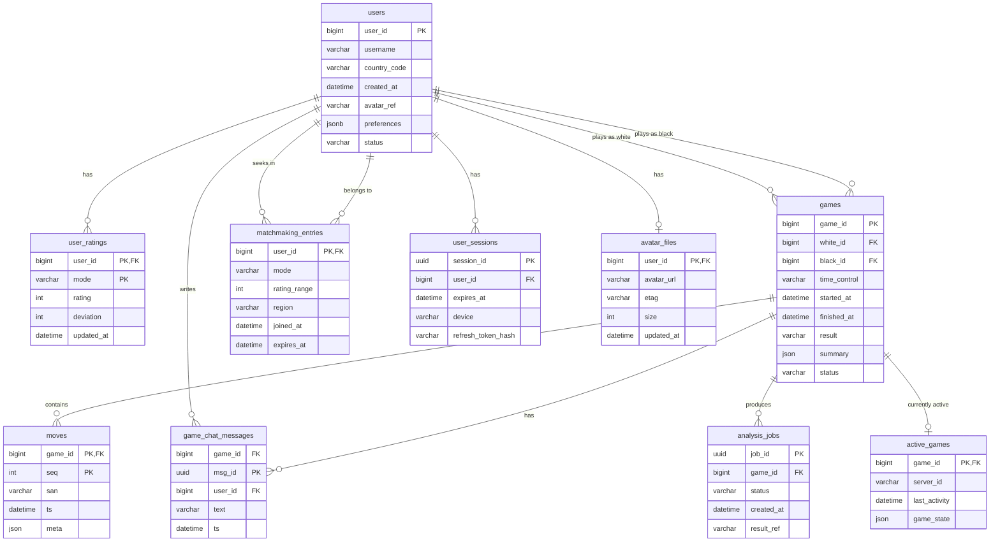

Курсовая работа по дисциплине "Проектирование высоконагруженных систем"

*Малютин Илья, осень 2025*

## Содержание
* [**1. Тема, аудитория, функционал**](#1-тема-аудитория-функционал)
* [**2. Расчёт нагрузки**](#2-расчёт-нагрузки)
* [**3. Глобальная балансировка нагрузки**](#3-глобальная-балансировка-нагрузки)
* [**4. Локальная балансировка нагрузки**](#4-локальная-балансировка-нагрузки)
* [**5. Логическая схема БД**](#5-логическая-схема-бд)
* [**6. Физическая схема БД**](#6-физическая-схема-бд)

## 1. Тема, аудитория, функционал

### Тема
Chess.com - онлайн-платформа для игры в шахматы

### Аудитория

#### Мировой рынок [[1](https://www.buzzsprout.com/2432582/episodes/17541516-how-chess-com-became-the-world-s-top-chess-app)]
* Пользователи:
  * ```45 млн MAU```
  * ```10 млн DAU```
  * ```20 млн игр в день```
  * ```Самый популярный формат игры - рапид 10+0 минут```


#### Распределение по странам [[2](https://www.chess.com/article/view/chess-countries)]
* *США - ```21.95%``` пользователей*
* *Индия - ```10.20%``` пользователей*
* *Великобритания - ```4.45%``` пользователей*
* *Филиппины - ```3.65%``` пользователей*
* *Бразилия - ```3.55%``` пользователей*
* *Россия - ```3.25%``` пользователей*
* *Остальные страны - ```52.95%``` пользователей*

### Функционал

Ключевой функционал - онлайн-игра в шахматы

Ключевые продуктовые решения:
* Обучение и аналитика игр
* Регистрация и авторизация
* Поиск и автоматический подбор соперника
* Онлайн-игра в шахматы
* Система рейтингов ELO
* История и анализ партий
* Текстовый чат во время игры

## 2. Расчёт нагрузки

* Допущения:
    * Размер аватарки 100 Кб (Chess.com загружает аватарки 200x200 jpeg)
    * Профиль пользователя(метаданные): имя (3-20 символов), рейтинг, статистика - 2 Кб
    * Одна шахматная партия: 40 ходов, 80 полуходов, 1 Кб на хранение (т.к. - полуход это простая символьная строка длиной не более 4х)
    * Средняя продолжительность игры: 10 минут (самый популярный контроль времени 10+0 минут)
    * Пиковая нагрузка в 3 раза больше средней в общем случае и в 4 раза больше для операций ходов
    * Сообщение в чате: 100 символов
    * 5 сообщений на игру

### Расчет среднего размера хранилища на одного пользователя
* Профиль пользователя

$$100 + 2 = 102 \space Кб$$

* История партий

$$\frac{20 \cdot 10^6}{10 \cdot 10^6} = 2 \space игры \space в  \space день \space на \space DAU$$

$$2 \cdot 30 = 60 \space игр \space в  \space месяц$$

$$60 \cdot 1 \space Кб = 60 \space Кб$$

* Сообщения в чате

$$60 \cdot 5 \cdot 100 \cdot 1 \space байт = 30 \space Кб$$

### Расчет среднего количества действий пользователя по типам в день [[5](https://www.chess.com/ru/article/view/shakhmaty-tak-populiarny-chto-servera-chess-com-ne-spravliaiutsia)]
* Авторизация: 1 раз в день
* Поиск соперника: 2 раза в день
* Сделать ход: 80 полуходов × 2 игры = 160 действий
* Отправка сообщений: 10 сообщений в день
* Просмотр истории: 2 раза в день
* Анализ партии: 1 раз в день

### Продуктовые метрики

| Метрика                                | Значение                  |
|----------------------------------------|---------------------------|
| Месячная аудитория (MAU)               | 45 млн пользователей      |
| Дневная аудитория (DAU)                | 10 млн пользователей      |
| Профиль пользователя                   | ~102 КБ                   |
| История партий                         | ~60 КБ/мес               |
| Сообщения чата                         | ~30 КБ/мес               |
| Авторизация                            | 1/день                   |
| Поиск соперника                        | 2/день                   |
| Ходы в играх                           | 160 полуходов /день                 |
| Отправка сообщений                     | 10/день                  |
| Просмотр истории                       | 2/день                   |
| Анализ партии                          | 1/день                   |

### Расчет размера хранилища данных

* Профили пользователей

$$\frac{102 \cdot 45 \cdot 10^6}{1024 \cdot 1024 \cdot 1024} = 4,27 \space Тб$$

* История партий (за месяц)

$$\frac{60 \cdot 45 \cdot 10^6}{1024 \cdot 1024 \cdot 1024} = 2,51 \space Тб/мес$$

* Сообщения чата (за месяц)

$$\frac{30 \cdot 45 \cdot 10^6}{1024 \cdot 1024 \cdot 1024} = 1,26\space Тб/мес$$

* Сессии пользователей

$$16 \space байт \cdot 10 \cdot 10^6 = 160 \space Мб$$

### Расчет сетевого трафика

* Ходы/полуходы в играх
$$80 \cdot 2 \cdot 10 \cdot 10^6 = 8 \cdot 10^9 \space операций/день$$
$$8 \cdot 10^9 \cdot 100 \space байт = 0,8 \space Тб/день$$

* Сообщения чата
$$10 \cdot 10^6 \cdot 10 \cdot 100 \space байт = 10 \cdot 10^9 \space байт = 10 \space Гб/день$$

* Профили и статика
$$10 \cdot 10^6 \cdot 102 \space Кб = 1,02 \space Тб/день$$

### RPS 

| Действие                               | RPS в пике                | RPS                     |
|----------------------------------------|---------------------------|-------------------------|
| Авторизация                            | 347                      | $$\frac{10 \cdot 10^6}{24 \cdot 3600} = 116$$ |
| Поиск соперника                        | 694                      | $$\frac{20 \cdot 10^6}{24 \cdot 3600} = 231$$ |
| **Ходы в играх**                           | **~74000 (берем пиковый онлайн в прайм-тайме 1млн, в 2 раза больше среднего)**                     | $$\frac{80 \cdot 2 \cdot 10 \cdot 10^6}{24 \cdot 3600} = 18519$$ |
| Отправка сообщений                     | 3472                     | $$\frac{100 \cdot 10^6}{24 \cdot 3600} = 1157$$ |
| Просмотр истории                       | 694                      | $$\frac{20 \cdot 10^6}{24 \cdot 3600} = 231$$ |
| Анализ партии                          | 347                      | $$\frac{10 \cdot 10^6}{24 \cdot 3600} = 116$$ |
## 3. Глобальная балансировка нагрузки

- Функциональное разбиение по доменам
  - Домен управления (Control Plane): аутентификация/авторизация, профиль/соц-фичи, матчмейкинг, рейтинги, платежи, история партий, аналитика/репорты. Требования: strong consistency на критичных транзакциях, RTO/RPO минимальны, RPS умеренный, чувствительность к задержке средняя (до 150–200 мс приемлемо).
  - Игровой домен (Game Plane): реальное время — WebSocket-сессии, ходы, таймеры, чат, античит-триггеры первого уровня, уведомления. Требования: низкая задержка и джиттер, высокая fan-out способность и высокая емкость по одновременным соединениям. Консистентность для ходов — строгая по порядку в пределах игры, глобально возможна eventual.

- Обоснование расположения ДЦ (влияние на продуктовые метрики)
  - Цель — минимизировать p50/p95 задержку хода и чата, так как это напрямую влияет на:
    - Честность и UX в блице/рапиде: рост латентности на 50–100 мс увеличивает тайм-ауты и жалобы, снижает удержание и LTV.
    - Конверсию в повторные партии: ниже latency — больше партий/сессию.
    - Подбор соперника: локальный матчмейкинг уменьшает cross-region пинги в парах игроков.
  - Рекомендуемая сетка ДЦ:
    - Северная Америка: Вирджиния/Огайо (us-east) — близко к наибольшему кластеру США (≈22%), низкая задержка к востоку и приемлемая к западу. Влияет на p50 ходов для ~25% базы (США+Канада).
    - Европа: Франкфурт/Амстердам/Лондон — центр тяжести трафика ЕС+UK+часть MENA и западной РФ. Влияет на p95 задержку матчей EU–EU и EU–UK, где основная масса пар.
    - Азия: Мумбаи (Индия 10.2%) + Сингапур (ЮВА, Филиппины 3.65%, Австралия ближе через ПЛ) — два хаба для снижения межрегиональных RTT и балансировки муссонных/операторских сбоев.
    - Южная Америка: Сан-Паулу — критично для Бразилии (3.55%) из‑за дорогих трансатлантических линий.
    - Океания: Сидней — уменьшает пинги внутри региона и к Сингапуру.
  - Ожидаемый выигрыш по метрикам:
    - Снижение p95 latency хода на 120–180 мс для пользователей Индии/Бразилии/Океании.
    - Снижение количества дропов по тайм-аутам в блице на 10–20% в регионах с ранее высокими RTT.
    - Рост среднего количества партий на сессию на 3–7% в регионах с улучшенной латентностью.

- Расчет распределения запросов по типам и по ДЦ
  - Вход: пиковые RPS, в т.ч. ходы ≈ 74 000 RPS.
  - Региональная доля (приближение на основе распределения): 
    - NA 25% (США+Канада), EU 30% (ЕС+UK+часть РФ), AS 35% (Индия+ЮВА+часть иных), SA 5% (Бразилия+ЛатАм), OC 5% (Океания).
  - Распределение пикового RPS по ходам:
    - NA: 0.25 × 74 000 ≈ 18 500 RPS
    - EU: 0.30 × 74 000 ≈ 22 200 RPS
    - AS: 0.35 × 74 000 ≈ 25 900 RPS
    - SA: 0.05 × 74 000 ≈ 3 700 RPS
    - OC: 0.05 × 74 000 ≈ 3 700 RPS
  - Прочие API RPS : Авторизация 347, Поиск 694, История 694, Анализ 347 — всего ≈ 2 082 RPS. Распределим аналогично:
    - NA: ≈ 520 RPS, EU: ≈ 625 RPS, AS: ≈ 729 RPS, SA: ≈ 104 RPS, OC: ≈ 104 RPS
  - Трафик чата (3472 RPS пик): NA ≈ 868, EU ≈ 1042, AS ≈ 1215, SA ≈ 174, OC ≈ 174

- Схема DNS балансировки //TODO: переделать под свою балансировку
  - GeoDNS c latency-based и геополитиками:
    - Поставщики: Route53/NS1/Cloudflare DNS.
    - Записи: A/AAAA для edge VIP-адресов в каждом регионе.
    - Политики: geolocation/latency routing + health-check failover. TTL: 30–60s для возможности быстрого steering, при этом используем DNS resolvers с ECS (EDNS Client Subnet) для точного гео.
    - Weighted routing: для плавного перераспределения трафика между соседними ДЦ (например, AS: 70% SG / 30% BOM в часы пик у Индии).
  - Split-horizon: отдельные зоны для приватного трафика служебных кластеров.

- Схема Anycast балансировки
  - Anycast IP для edge L4 VIP:
    - BGP-анонс от PoP/edge в каждом регионе (через провайдеров/Cloudflare/Akamai).
    - Трафик по кратчайшему AS-пути локально попадает в ближайший регион.
    - Health steering: withdraw/AS-path prepending при деградации конкретного региона.
  - Применение: WebSocket/L4, TURN/STUN при p2p-фичах, TCP API с требованием минимального RTT.

- Механизм регулировки трафика между ДЦ
  - Управление долями через:
    - Weighted GeoDNS (перекладка в процентах).
    - BGP prepending/med для Anycast VIP – «удаляем» регион при деградации.
    - GSLB-контроллер: собирает SLI/SLO (p95 latency, error rate, saturation), публикует политики в DNS/BGP.
  - Cross-DC spillover для игровых сессий:
    - Разрешено только при перегрузке и с предупреждением UX (возможен рост RTT). Предпочтение — матчить локальные пары, иначе fallback в соседний ДЦ (EU<->UK, SG<->SYD, BOM<->SG, VA<->OH).
  - Sticky locality:
    - Игровые сессии pin’ятся к ДЦ, где стартовал матч; миграция в ходе партии запрещена, кроме аварийного drain с state handover через Kafka/DB.


## 4. Локальная балансировка нагрузки
- Многоуровневая схема в каждом ДЦ //TODO: Слишком много уровней. Посмотреть что можно объединить
  - Уровень 0: CDN/WAF/Rate Limit (Cloudflare/Akamai) — TLS DoS защита, кеш статики/аватаров, базовый бот-фильтр.
  - Уровень 1: L4 Anycast VIP/GW (Envoy/HAProxy/NLB) — TCP/UDP termination, проксирование на L7 кластера; поддержка WebSocket pass-through и PROXY protocol.
  - Уровень 2: L7 шлюз (NGINX/Envoy Ingress) — SSL termination, HTTP routing, канареечные релизы, mTLS к сервисам.
  - Уровень 3: Сервис-меш (Istio/Linkerd) — per-request retry/breakers, наблюдаемость, авторизация.
  - Уровень 4: Внутрикластерный баланс (kube-proxy/IPVS + подовые sidecars) — распределение по репликам.
  - Специализированный путь для игры:
    - WebSocket Gateway с sticky session по ключам: game_id, session_id, или consistent-hash по user_id для равномерности.
    - State host pin: все ивенты одной игры на один game-server shard.

- Механизмы резервирования
  - Формула емкости на отказ: N активных узлов с резервом по схеме N+1 или N*2/(N+1) эффективной емкости.
    - Пример: требуется 1 000 000 одновременных WebSocket. Если одна нода держит безопасно 50 000 WS, N=20 дает 1 000 000 при 0% резерва. С учетом резерва по формуле (N*2)/(N+1) ≈ (20*2)/21 ≈ 1.9 эквивалента N, значит планируем 24–26 узлов, чтобы выдержать выход 2–3 узлов без потери цели.
  - Active-Active балансировщики на каждом уровне (минимум 2 AZ):
    - L4 GW: 2+ в каждой зоне, общий пул с fail-open на соседнюю зону.
    - L7 Ingress: 3+ реплики на зону для равномерной нагрузки и rolling updates.

- Расчет количества балансировщиков //TODO: избыточное кол-во балансеров; Резервирование
  - Ограничители: SSL termination (CPS), пропускная способность, количество одновременных соединений.
  - Входные ориентиры (по материалам NGINX):
    - HTTPS CPS (TLS handshakes) на современном x86 может достигать 10k–20k CPS на инстанс при оптимизации. Для API у нас ~2k RPS, средняя доля новых соединений обычно 5–20% благодаря keep-alive/HTTP2. Возьмем 20% на пике: 0.2 × 2 082 ≈ 416 CPS.
    - Итог по API: достаточно 2 инстансов L7 (по 416 CPS каждый) для покрытия, берем 4–6 на ДЦ с резервом и для DDoS/бурстов.
  - WebSocket:
    - Конкурентные соединения: пиковый онлайн 1 000 000 глобально, в ДЦ по долям (из п.3): NA ~250k, EU ~300k, AS ~350k, SA ~50k, OC ~50k.
    - Емкость L4/L7 узла: консервативно 50k WS/узел (ядро Linux epoll/tuning, 64GB RAM, NIC 25–50GbE). 
    - Требуемые узлы L4/L7 WebSocket GW:
      - NA: 250k / 50k = 5 узлов. С резервом N+1 и по формуле N*2/(N+1) планируем 8–10 узлов.
      - EU: 300k / 50k = 6 → план 9–11.
      - AS: 350k / 50k = 7 → план 10–12.
      - SA: 50k / 50k = 1 → план 3–4.
      - OC: 50k / 50k = 1 → план 3–4.
    - Пропускная способность: ход/чат — малые сообщения (сотни байт). Даже при 74k RPS ходов и скажем 1 KB/ход общая полоса < 600 Mbit/s/регион, что далеко ниже 25GbE. Критичнее — количество соединений и контекстные переключения.
  - Вывод:
    - L7 API Ingress: 4–6 инстансов на ДЦ.
    - L4/L7 WebSocket GW: 8–12 инстансов на крупные ДЦ (NA/EU/AS), 3–4 на малые (SA/OC).


## 5. Логическая схема БД
- Требования к формату: без привязки к конкретным СУБД и шардингу, все данные (включая «файловые»), кеши и буферы, размеры, QPS, консистентность, распределение по ключам.

- Список основных таблиц/хранилищ и нагрузки
  - users: профиль пользователя.
    - Поля: user_id, username, country_code, created_at, avatar_ref, preferences, status.
    - Размер: ~2 KB метаданные; аватар как файл отдельно (см. ниже).
    - QPS: R 1k–5k регионально, W 0.1k (регистрация/правки).
    - Консистентность: Strong для уникальности username и ссылок.
    - Ключи: user_id равномерный; username может быть «горячим» при поиске.
  - user_ratings: рейтинги по режимам.
    - Поля: user_id, mode, rating, deviation, updated_at.
    - Размер: ~50–80 B/режим.
    - QPS: R 5k, W 1–2k (после партий).
    - Консистентность: Strong при апдейте после завершения игры.
    - Ключи: user_id равномерный; всплески при турнирах.
  - games: карточка партии.
    - Поля: game_id, white_id, black_id, time_control, started_at, finished_at, result, summary.
    - Размер: ~200–300 B.
    - QPS: R 3–5k (история), W 1–2k (создание/завершение).
    - Консистентность: Strong при создании/закрытии.
    - Ключи: game_id равномерный; выборки по user_id «горячие» (скос по активным).
  - moves: ходы внутри партии.
    - Поля: game_id, seq, san, ts, meta.
    - Размер записи: ~40–60 B; на игру ~1 KB.
    - QPS: R 10–20k (просмотры/анализ), W до 74k (пик ходов).
    - Консистентность: упорядоченность внутри game_id обязательна; глобально eventual приемлема.
    - Ключи: game_id — горячие ключи для активных игр (временная «горячесть» по хвосту распределения).
  - game_chat_messages:
    - Поля: game_id, msg_id, user_id, text(<= 256 B), ts.
    - Размер: ~150–300 B.
    - QPS: R 2–4k, W 3–4k в пик.
    - Консистентность: порядок в рамках game_id; eventual межрегионально допустима.
    - Ключи: как у moves — временные «горячие» game_id.
  - user_sessions (кеш/буфер):
    - Поля: session_id, user_id, expires_at, device, tokens.
    - Размер: ~128–256 B.
    - QPS: R 5–10k, W 2–3k (логины/рефреши).
    - Консистентность: Strong на валидации; TTL.
    - Ключи: равномерный по user_id; всплески в прайм-тайм.
  - matchmaking_queue (кеш/буфер):
    - Поля: bucket_key (mode, rating_range, region), entries(list<user_id>), updated_at.
    - Размер: зависим от очереди, оцениваем ~1–10 KB/bucket.
    - QPS: R/W 5–20k.
    - Консистентность: локально Strong на bucket; eventual кросс-регионально.
    - Ключи: buckets «горячие» по популярным рейтингам.
  - avatar_files (файловые данные, метаданные):
    - Поля: user_id, avatar_url, etag, size, updated_at.
    - Размер: 100 KB файл, метаданные 200 B.
    - QPS: R высокие, но через CDN; W низкие.
    - Консистентность: eventual для CDN.
  - analysis_jobs (буфер заданий):
    - Поля: job_id, game_id, status, created_at, result_ref.
    - Размер: 200–400 B.
    - QPS: R/W 1–2k.
    - Консистентность: Strong для статусов.

- Логическая ER‑схема


- Особенности распределения нагрузки по ключам
  - moves/chat: «горячие» game_id для активных игр — требуется партиционирование по game_id и ограничение «горячих» шардов.
  - matchmaking_queue: горячие buckets по популярным диапазонам рейтингов и режимам.
  - users/user_ratings: равномерно, но пиковые чтения по топ-игрокам/стримам.
  - Кеши: TTL-ориентированная нагрузка, всплески на смене прайм-тайма.

## 6. Физическая схема БД

- Выбор СУБД и обоснование (потаблично)
  - users, user_ratings, games: PostgreSQL (реляционные связи, транзакции, строгая консистентность, богатые индексы).
  - moves, game_chat_messages: Cassandra/ScyllaDB (широкие строки по game_id, высокая скорость записи, линейное масштабирование, порядок по seq).
  - user_sessions, matchmaking_queue: Redis Cluster (низкая задержка, TTL, структуры данных lists/sets/zsets; для очередей — streams).
  - avatar_files: объектное хранилище S3-совместимое + CDN (метаданные в Postgres).
  - analysis_jobs: PostgreSQL или Kafka + компактное состояние в Postgres (в зависимости от пайплайна).
  - Дополнительно для аналитики: ClickHouse/BigQuery для оффлайн-анализа партий и ходов.

- Индексы и денормализация
  - users: PK(user_id), UNIQUE(username), IDX(country_code). Денормализация: cached_rating (by most-used mode), vanity stats для профиля.
  - user_ratings: PK(user_id, mode), IDX(updated_at).
  - games: PK(game_id), IDX(white_id), IDX(black_id), композитный IDX(user_id, started_at desc) через материализованную таблицу games_by_user для быстрого листинга истории.
  - moves (Cassandra): PRIMARY KEY ((game_id), seq) для упорядоченных чтений/записей; TTL не используется, хранение долговременное.
  - game_chat_messages (Cassandra): PRIMARY KEY ((game_id), ts, msg_id); дополнительные индексы не нужны, чтения по game_id диапазону.
  - user_sessions (Redis): ключ session:{session_id}, и set user:{user_id}:sessions для инвалидации; TTL на ключах.
  - matchmaking_queue (Redis): ключи mm:{region}:{mode}:{bucket}, структура zset/stream; вторичные индексы не требуются.
  - analysis_jobs: PK(job_id), IDX(status, created_at).
  - Денормализация:
    - games_by_user(user_id, started_at desc, game_id, result, summary_light) — быстрая история.
    - rating_snapshot в users — для быстрого профиля без join.
    - message_count в games — счетчик чата.

- Шардирование и резервирование (потаблично)
  - PostgreSQL:
    - users, user_ratings: hash-шардинг по user_id на 8–16 шардов/регион, репликация 1 primary + 2 replicas (sync для близкой AZ, async для удаленной AZ).
    - games: hash по game_id, 8–16 шардов; доп. материализованный индекс games_by_user шардинг по user_id.
    - Резервирование: Patroni/pg_auto_failover; RPO≈0 (sync AZ), RTO<30–60s.
  - Cassandra:
    - Ключ партиции: game_id, RF=3 на 3 AZ, LWT не используется в горячем пути.
    - Размер партиции — до ~2–4 KB/игру (ок), контроль через компакции; guard на seq.
    - Балансировка: случайные токены, rebalancing при росте.
  - Redis Cluster:
    - Кластеры по региону, 6–12 шардов, реплика 1:1, настройка min-slaves-to-write, persistence RDB+AOF.
    - Устойчивость: sentinel/оператор, быстрый failover.
  - Георепликация:
    - Горячие данные Game Plane не реплицируем межрегионально синхронно — только асинхронные события (Kafka) для аналитики/истории.
    - Control Plane — асинхронная лог-реплика для аварийного DR, с возможностью «promote» по кнопке.

- Клиентские библиотеки и интеграции
  - Postgres: драйверы + PgBouncer (transaction pooling) на каждый шард, HAProxy/Envoy как TCP LB к пулам.
  - Cassandra: официальные драйверы с load balancing policy (DCAwareRoundRobin), retry/backoff.
  - Redis: cluster-aware клиенты (lettuce, jedis, node-redis), sharding transparent.
  - S3: SDK с multipart upload, S3 Transfer Acceleration; CDN origin pull.
  - Kafka (для событий ходов/чата/игр в аналитику): продьюсеры с acks=1 в горячем пути.

- Балансировка запросов / мультиплексирование подключений
  - PgBouncer перед каждым шардом Postgres, pool size по формуле (cpu*cores*2..4), агрегация соединений.
  - Для Cassandra — пул соединений на клиент, multiplexing в драйвере.
  - Redis — пулы и пайплайнинг, cluster routing в клиенте.
  - Сервис-меш — connection pooling между микро-сервисами (HTTP/2, gRPC).

- Схема резервного копирования
  - Postgres:
    - Ежедневный full basebackup + непрерывная архивация WAL (PITR). Хранение в объектном хранилище 30–90 дней. Тесты восстановления еженедельно.
  - Cassandra:
    - Нодовые снапшоты (SSTable) каждые 4–6 часов в S3, incremental backups включены. Проверки восстановления в стендбай-кластере ежемесячно.
  - Redis:
    - RDB каждые 5–15 минут + AOF everysec. Для сессий допускается потеря нескольких минут (RPO ~ 5 мин).
  - S3/аватары:
    - Версионирование бакета, Lifecycle-политики, cross-region replication для DR.
  - Каталог бэкапов:
    - Метаданные бэкапов в отдельной базе (BackupsDB) для отслеживания RPO/RTO и автоматических DR-дрилей.

- Физическая схема (с привязкой к БД, индексам, шардам)


- Примерные размеры/нагрузки (итоги)
  - users: ~2 KB/пользователь метаданные, чтения 1–5k RPS/регион.
  - avatars: 100 KB/файл, кеш CDN 95%+, origin RPS низкий.
  - games: 2 игры/день на DAU → 20M игр/день, запись карточек ~231 RPS средне, пик ~700–900 RPS глобально.
  - moves: запись до 74k RPS пик глобально, чтение 10–20k RPS.
  - chat: запись 3–4k RPS, чтение 2–4k RPS.
  - sessions: 5–10k RPS чтение, 2–3k RPS запись.
  - matchmaking: 5–20k R/W на кластере, чувствителен к латентности.

TODO: Алгоритмы балансировки игр
TODO: Алгоритмы резервирования
## Источники
1. [How Chess.com Became The World's Top Chess App](https://www.buzzsprout.com/2432582/episodes/17541516-how-chess-com-became-the-world-s-top-chess-app) - данные о MAU, DAU и количестве игр
2. [Chess.com Traffic Analytics](https://www.chess.com/article/view/chess-countries) - географическое распределение пользователей
3. [Chess.com Statistics](https://www.chess.com/forum/view/help-support/how-much-data-does-one-chess-game-use) - дополнительная статистика платформы
4. [Online Chess Platforms Comparison](https://www.chess.com/blog/OnlineChessTeacher/best-online-platforms-to-play-chess) - особенности функционирования платформ
5. [Шахматы так популярны, что сервера Chess.com не справляются!](https://www.chess.com/ru/article/view/shakhmaty-tak-populiarny-chto-servera-chess-com-ne-spravliaiutsia) - официальная статься о нагрузке
6. [Количество ходов в средней партии в шахматы](https://ru.wikipedia.org/wiki/Число_Шеннона)